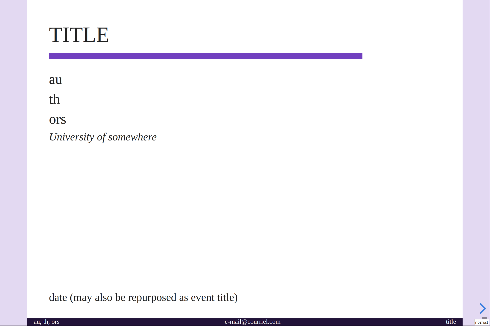
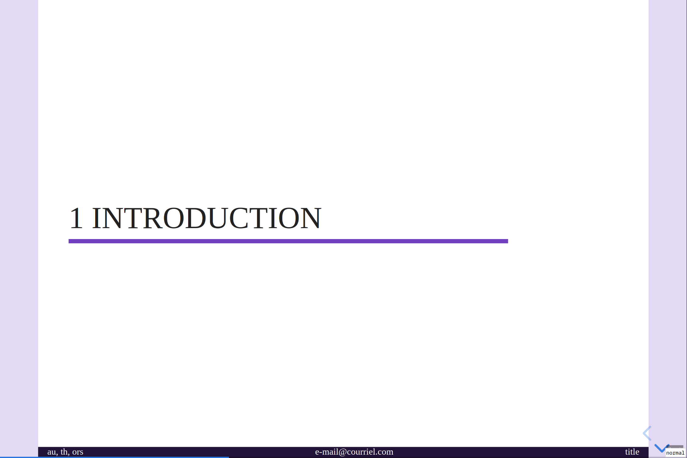
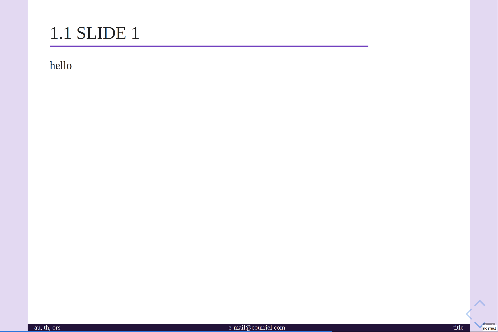
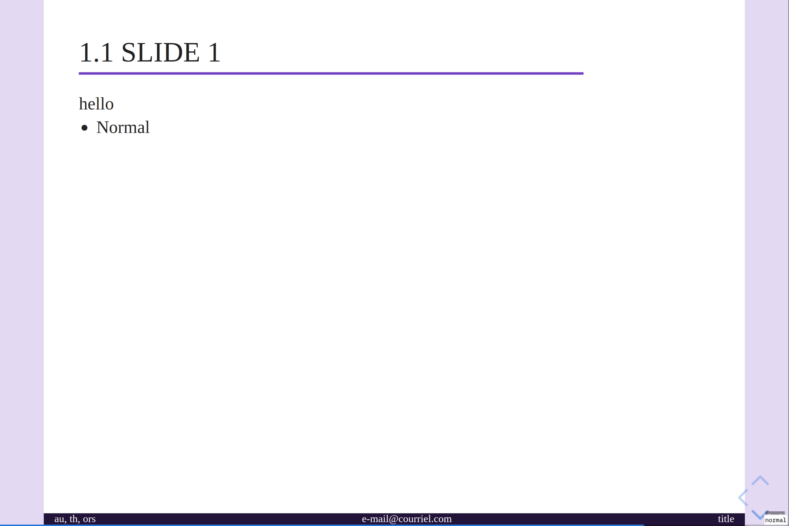
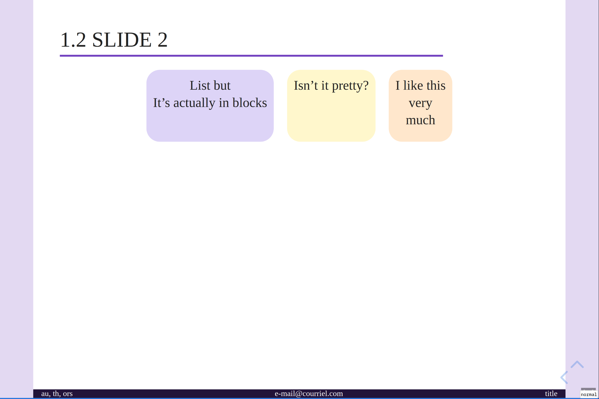

# A nice purple theme for Reveal.js 


## Instructions

I built this theme to go with my [template](https://github.com/tbrugere/pandoc-revealjs-template) to make revealjs slides with pandoc

Just include the theme `css`  in your `html`. This theme is meant to be used **without** revealjs layout adjustment (ie with `disableLayout: True`).

This should automatically adjust the font size to the viewport (with **pure css**, yes it's possible) so that the slides always display  with the same aspect ratio (if you only use `em`, `rem° or `%` as units). The default is 4/3 but it can be customized through scss variables. 

## Demo & Features

screenshots: 








Here is an [exemple of a presentation I built with this theme](https://tristan.bruge.re/ot_markov_distances/presentation) with changed colorscheme.


### Features

> [!WARNING]
> Responsive resizing only works if elements are sized with relative 
> units (`%`) or font units (`rem` and `em`). 
>  Avoid using absolute units (`px`, `cm`, `in`...) and viewport units `vw`, `vh`

## Customizing

This is called "cleanpurple", but you can totally change the main color (or the font size, or most things), just edit the variables in the css.

For an example of customization, see for example [here](https://github.com/tbrugere/pandoc-revealjs-template/blob/ucsd/resources/custom_theme/custom.scss)

## Building

To build, we need the `revealjs` source, included in the `revealjs/` submodule. Check that you have cloned the submodule (either by cloning directly with) `--recurse-submodules`  or run 

```console
$ git submodule update --init --recursive
```

We also need `sass` to be installed.

Afterwards, you can just build with

```console
$ make
```

The resulting `css` file will be in `dist/`.
